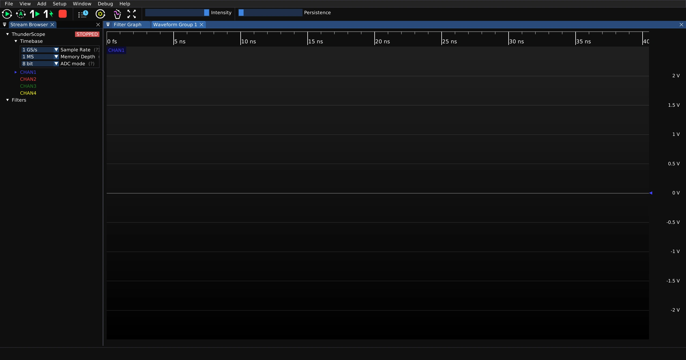

.. _Getting-Started:

Getting Started
===============

Follow the instructions below to get started with ThunderScope

Connect the Device
------------------

.. tab:: TS-USB4

    Connect the ThunderScope to a Thunderbolt 3/4/5 or USB4 port on your host computer

    .. image:: ./_images/USB4-Connected.webp
        :alt: ThunderScope connected to a host laptop

.. tab:: TS-PCIe

    Connect the ThunderScope to a x4 width or higher PCIe slot on your host computer

    .. image:: ./_images/PCIe-Connected.webp
        :alt: ThunderScope PCIe card installed in a motherboard's PCIe slot  

Prerequisite Steps for Install
------------------------------

.. tab:: Linux

    Install the dependencies

    .. tab:: Debian

        .. code::

            $ sudo apt install build-essential git dkms

    .. tab:: Arch

        .. code::

            $ sudo pacman -Syu base-devel git dkms
    
    .. tab:: Fedora

        .. code::

            $ sudo dnf install make automake gcc gcc-c++ kernel-devel git dkms

    Clone the ThunderScope repo and navigate to the Software directory

    .. code::

        $ git clone --depth 1 https://github.com/EEVengers/ThunderScope.git
        $ cd ThunderScope/Software

.. tab:: Windows

    There are no prerequisites to install the ThunderScope software on Windows

.. tab:: macOS
    
    Install `Xcode <https://developer.apple.com/xcode/>`_
    
    Clone the ThunderScope repo and navigate to the Software directory

    .. code::

        % git clone --depth 1 https://github.com/EEVengers/ThunderScope.git
        % cd ThunderScope/Software

Driver Install
--------------

.. tab:: Linux
    
    Check if secure boot is enabled

    .. code::

        $ mokutil --sb-state

    If the command returns "SecureBoot enabled", you can either disable secure boot in your BIOS settings, or run the commands below to generate an MOK key so that DKMS can sign the driver for you.

    .. code::
        
        $ sudo dkms generate_mok
        $ sudo mokutil --import /var/lib/dkms/mok.pub

    If you are on Ubuntu or a Ubuntu-based distro, run just the following command instead

    .. code::

        $ sudo mokutil --import /var/lib/shim-signed/mok/MOK.der

    Reboot your computer. At boot you'll see the MOK Manager EFI interface. Hit any key to enter the menu, select "Enroll MOK", "Continue", then "Yes". After this, enter the password you set in the previous step and then select the "Reboot" option to complete the MOK key install.

    Once you have disabled secure boot or installed your own MOK key, you can proceed with building and installing the driver.
    Pull the driver repo, install the driver with DKMS and then install the udev rules file.

    .. code::

        $ git clone https://github.com/EEVengers/ts_litex_driver_linux.git
        $ cd ts_litex_driver_linux
        $ sudo make dkms
        $ sudo make udev-install

.. tab:: Windows

    Download and run the `ThunderScope driver installer <https://github.com/EEVengers/ts_litex_driver_win/releases/download/v1.0.0/ThunderScope-driver-win-x64-v1.0.0.msi>`_, 
    hit "Next" when prompted by the installer, select "Yes" on the Windows UAC prompt, 
    then click "Finish" on the installer.

.. tab:: macOS
    
    .. note::

        This install procedure is a temporary solution until we can get the drivers signed and packaged for macOS.
    
    Disable system integrity protection, instructions on how to do so are `here <https://developer.apple.com/documentation/security/disabling-and-enabling-system-integrity-protection>`_.

    Turn on developer mode, this disables some restrictions, like having to run from /Applications

    .. code::

        % systemextensionsctl developer on
    
    Pull the driver repo, then build and reload client app and driverkit driver

    .. code::

        % git clone https://github.com/EEVengers/ts_litex_driver_macos.git
        % cd ts_litex_driver_macos
        % ./build.sh
        % ./build.sh && ./reload.sh  

    Follow the system prompts to authorize the driver extension

Software Install
----------------

.. tab:: Linux
    
    Navigate back to the software directory and run the install script
    
    .. code::
        
        $ cd ..
        $ ./install_ts_software.sh
 
    Download and install an ngscopeclient package suitable for your distro from the `latest tagged release <https://github.com/ngscopeclient/scopehal-apps/releases/tag/v0.2.2>`_
    
.. tab:: Windows

    Download and run the `ThunderScope software installer <https://github.com/EEVengers/ts-windows-installer/releases/download/v1.0.0/ThunderScope-2026.08-win-x64.msi>`_, 
    hit "Next" when prompted by the installer, then click "Finish" on the installer. 

.. tab:: macOS
    
    Navigate back to the software directory and run the install script
    
    .. code::
        
        $ cd ..
        $ ./install_ts_software.sh
 
    Download and install the ngscopeclient mac ``.dmg`` package from the `latest tagged release <https://github.com/ngscopeclient/scopehal-apps/releases/tag/v0.2.2>`_
    
Start the Software
------------------

.. tab:: Linux

    Run the launch script in the Software directory of the cloned ThunderScope repo

    .. code::

        $ ./ThunderScope.sh   

.. tab:: Windows

    Launch the ThunderScope application from the desktop shortcut or start menu

.. tab:: macOS

    Run the launch script in the Software directory of the cloned ThunderScope repo

    .. code::

        $ ./ThunderScope.sh   

This will launch an instance of ngscopeclient that is pre-connected to the TS.NET.Engine triggering software.

You are now ready to start :ref:`using ThunderScope! <Using-ThunderScope>`
