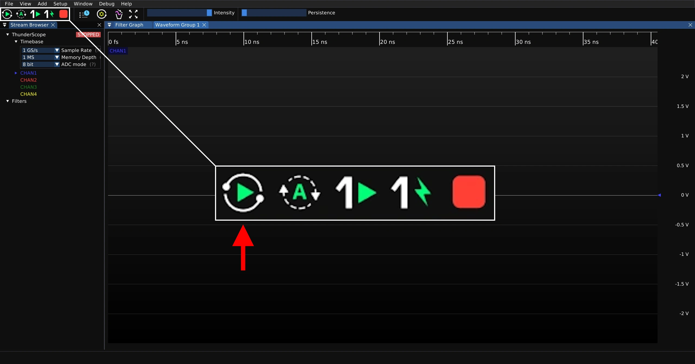
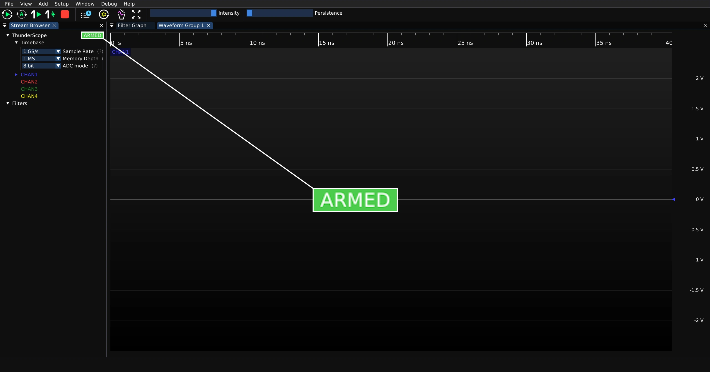
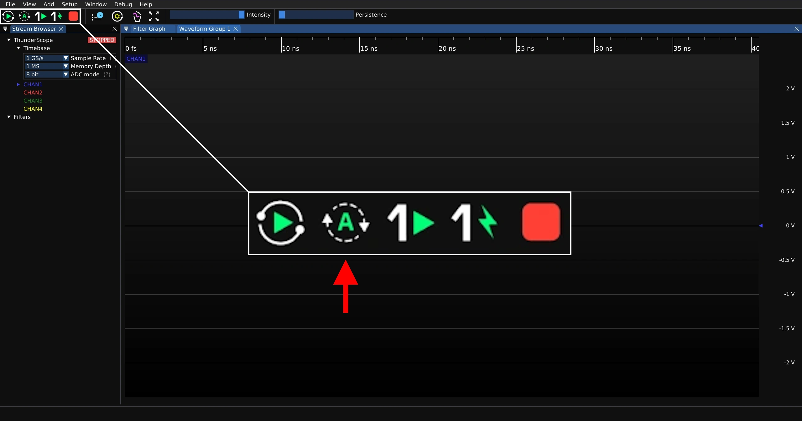
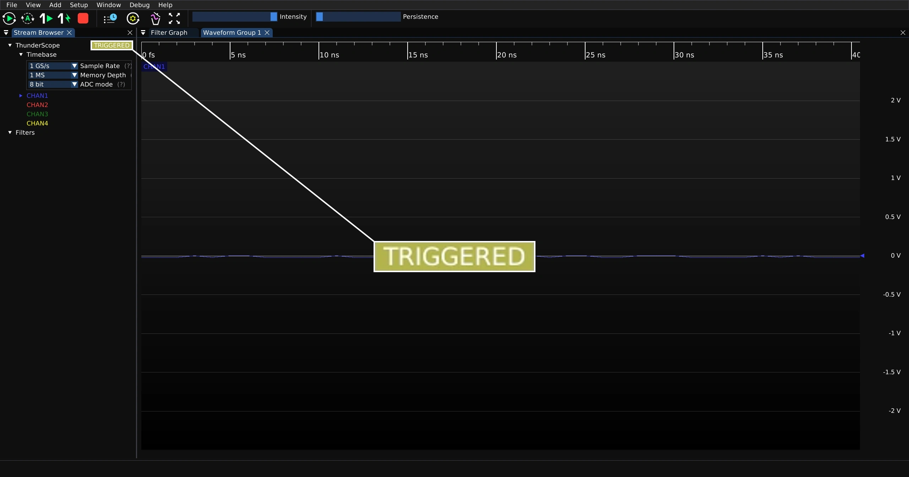
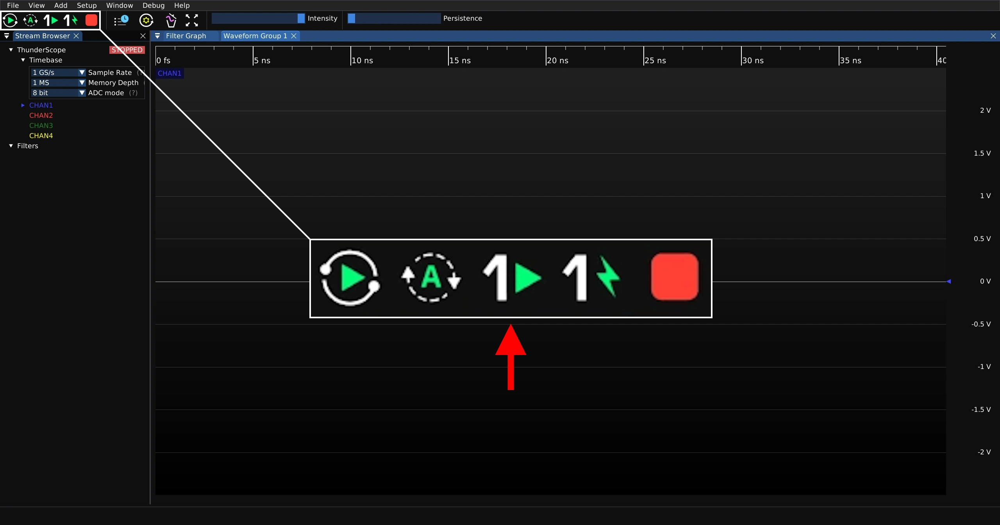
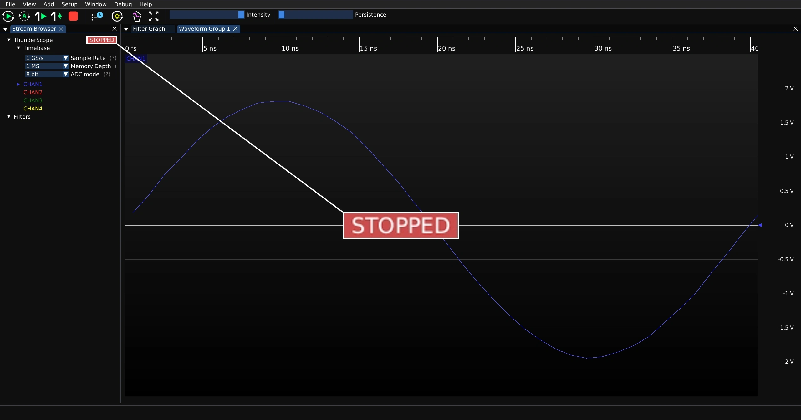
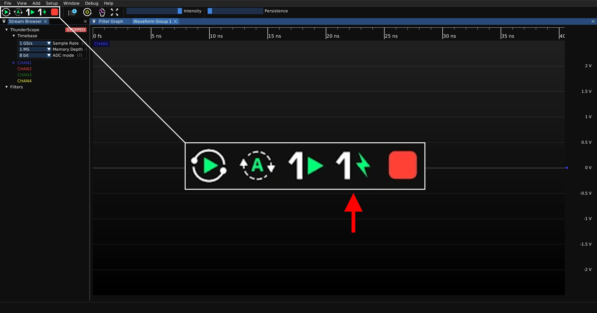
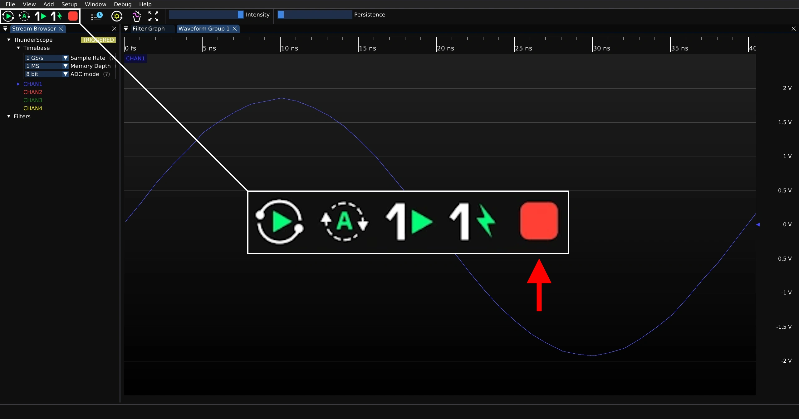

.. _Capture-Modes:

Capture Modes
=============

This guide assumes you have installed the driver and software for ThunderScope. 
If you have not already done do, please follow the :ref:`getting started guide <Getting-Started>`.

Normal Trigger
--------------

Press the button shown below to start capturing in normal trigger mode.

When there is no signal that matches the trigger condition, the status indicator will show "ARMED" and the waveform view will not update.

When a signal matches the trigger condition, the status indicator will show "TRIGGERED" and the waveform view will update with the triggered waveform as long as the signal is present.

Auto Trigger
------------

Press the button shown below to start capturing in auto trigger mode.

When there is no signal that matches the trigger condition, the status indicator will show "TRIGGERED" and the waveform view will continuously update with untriggered data. 
This is very useful for looking at unknown signals before a good trigger condition can be set. 

When a signal matches the trigger condition, the status indicator will show "TRIGGERED" and the waveform view will update with the triggered waveform as long as the signal is present.

Single Trigger
--------------

Press the button shown below to take a single normal trigger capture.

When there is no signal that matches the trigger condition, the status indicator will show "ARMED" and the waveform view will not update.

When a signal matches the trigger condition, the status indicator will show "STOPPED" and the waveform view will show the single triggered waveform and then stop updating.

Force Trigger
-------------

Press the button shown below to take a single capture, ignoring trigger conditions.

The status indicator will show "STOPPED" and the waveform view will show the single untriggered waveform and then stop updating.

Stop Capture
------------

Press the button below to stop a capture that is currently active.

The status indicator will show "STOPPED" and the waveform view will no longer update.

